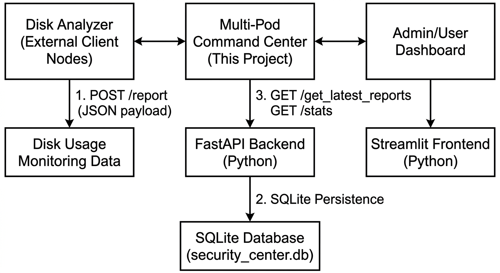
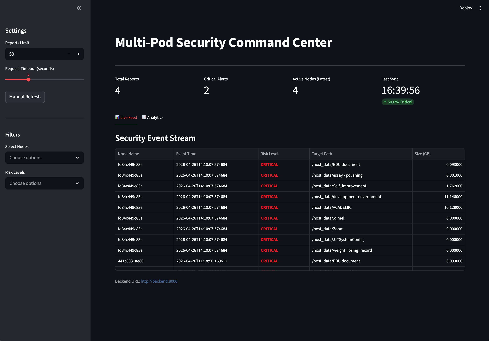
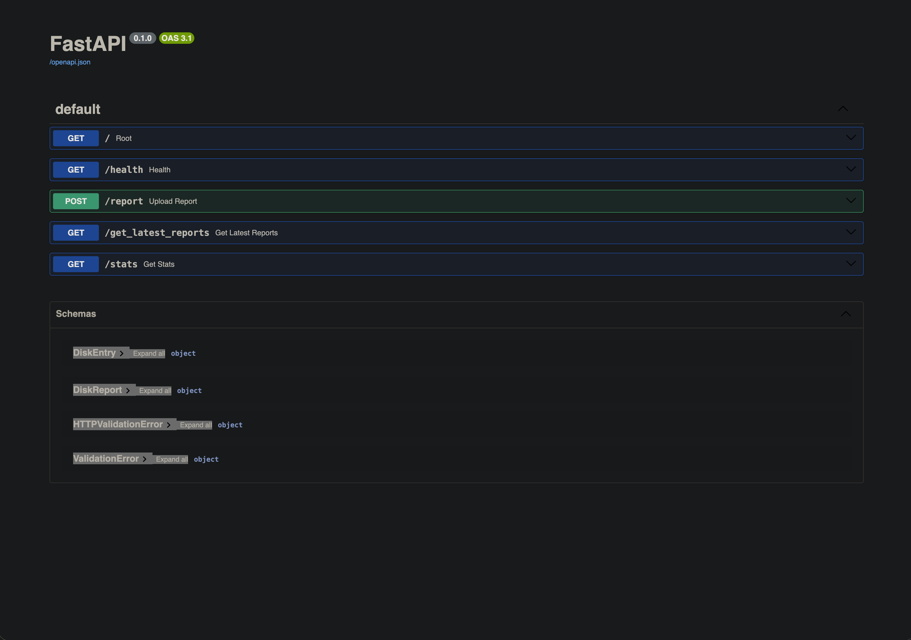
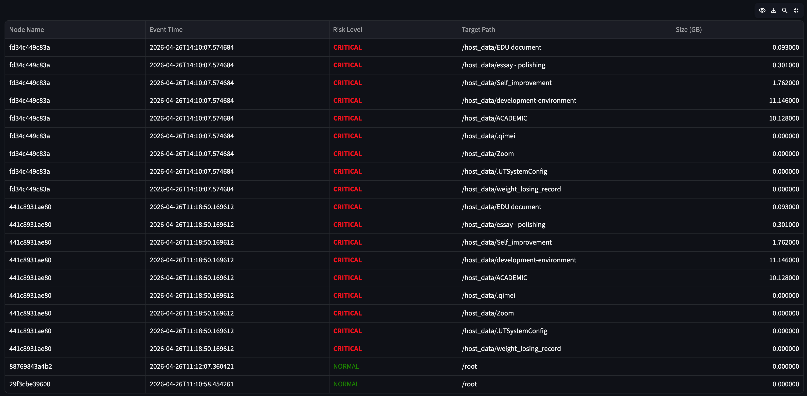
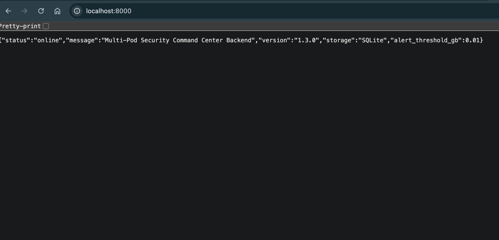

# Multi-Pod Security Command Center

[](https://www.python.org/downloads/)
[](https://fastapi.tiangolo.com/)
[](https://streamlit.io/)
[](https://opensource.org/licenses/MIT)

## Certification


## Table of Contents

- [Project Description & Problem Statement](#project-description--problem-statement)
- [Architecture Overview](#architecture-overview)
- [Tech Stack](#tech-stack) 
- [Project Structure](#project-structure)
- [Setup & Run Instructions](#setup--run-instructions)
- [Screenshots & Demo](#screenshots--demo)
- [API Reference](#api-reference)
- [Threshold Configuration](#threshold-configuration)
- [Docker Deployment](#docker-deployment)
- [Kubernetes Deployment](#kubernetes-deployment-optional)
- [Pitch Presentation](#pitch-presentation)
- [Demo Video](#demo-video)
- [Faculty Feedback](#faculty-feedback)
- [Troubleshooting](#troubleshooting)

## Project Description & Problem Statement

**Multi-Pod Security Command Center** is a comprehensive security monitoring solution designed to address the critical need for real-time disk usage monitoring and anomaly detection in distributed systems. 

### Problem It Solves

In modern IT infrastructure, uncontrolled disk space consumption can lead to:
- Service outages when critical systems run out of storage
- Security breaches from unmonitored log file growth
- Performance degradation due to insufficient disk space for operations
- Lack of visibility into storage patterns across distributed nodes

This project provides a centralized command center that:
- Monitors disk usage across distributed nodes in real-time
- Detects anomalies using configurable threshold-based alerts
- Visualizes trends through an intuitive dashboard
- Persists historical data for forensic analysis and pattern recognition
- Supports containerized deployment for easy scalability

### Target Audience
- System administrators managing multiple servers
- DevOps teams monitoring cloud infrastructure  
- Security teams tracking file integrity across environments
- Academic projects demonstrating distributed monitoring concepts

---

## Architecture Overview

### System Architecture Diagram


### Core Components

1. **Backend Service** (`backEnd/main.py`)
   - FastAPI web server with RESTful API endpoints
   - Real-time disk usage analysis and threshold detection
   - SQLite database operations with proper connection management
   - Configurable alert thresholds via environment variables

2. **Frontend Dashboard** (`frontEnd/app.py`)
   - Streamlit-based real-time monitoring interface
   - Interactive charts and filtering capabilities
   - Responsive design for various screen sizes
   - Error handling and connection status monitoring

3. **Data Persistence** (`security_center.db`)
   - SQLite relational database with two main tables:
     - `reports`: Master records with timestamps and host information
     - `report_items`: Detailed disk usage measurements with criticality classification

### Data Flow Process

1. **Data Ingestion**: External nodes send disk usage reports via `POST /report`
2. **Processing**: Backend analyzes data against configurable thresholds
3. **Classification**: Events marked as `NORMAL` or `CRITICAL` based on size
4. **Storage**: Data persisted in SQLite for historical analysis
5. **Visualization**: Frontend fetches and displays data through interactive charts
6. **Monitoring**: Real-time dashboard updates with live metrics

---

## Tech Stack

### Backend Technologies
- **Python 3.10+** - Core programming language
- **FastAPI 0.104.1** - Modern, high-performance web framework
- **Pydantic 2.5.0** - Data validation and settings management
- **SQLite3** - Lightweight database for persistence
- **Uvicorn** - ASGI server for production deployment

### Frontend Technologies  
- **Streamlit 1.32.2** - Rapid web application development
- **Pandas 2.1.4** - Data manipulation and analysis
- **Plotly 5.18.0** - Interactive visualization library
- **Requests 2.31.0** - HTTP client for API communication

### Deployment & Infrastructure
- **Docker 20.10+** - Containerization platform
- **Docker Compose** - Multi-container orchestration
- **Kubernetes** - Container orchestration (optional)
- **SQLite** - Embedded database (production: consider PostgreSQL)

### Development Tools
- **Pip** - Python package management
- **Virtual Environment** - Dependency isolation
- **Git** - Version control system

### Key Features Enabled by Tech Stack
- Real-time Processing: FastAPI's async capabilities
- Data Validation: Pydantic model enforcement
- Visual Analytics: Plotly interactive charts
- Containerization: Docker for consistent environments
- Scalability: Kubernetes-ready architecture

---

## Project Structure

```text
Multi_pod/
├── backEnd/                    # Backend API service
│   ├── main.py                # FastAPI application with routes and logic
│   ├── requirements.txt       # Python dependencies
│   └── Dockerfile            # Container configuration
├── frontEnd/                   # Frontend dashboard
│   ├── app.py                # Streamlit dashboard application
│   ├── requirements.txt      # Python dependencies  
│   └── Dockerfile           # Container configuration
├── docker-compose.yml         # Multi-container development setup
├── k8s-deployment.yaml       # Kubernetes deployment manifest
├── security_center.db        # SQLite database (generated at runtime)
└── README.md                 # This comprehensive documentation
```

**Key Files Description:**
- `backEnd/main.py`: Core API server with security logic and database operations
- `frontEnd/app.py`: Interactive dashboard with real-time monitoring and filtering
- `docker-compose.yml`: Complete development environment setup
- `k8s-deployment.yaml`: Production deployment configuration

---

## Setup & Run Instructions

### Prerequisites

Before you begin, ensure you have the following installed:

**Required:**
- **Python 3.10+** (3.12 is fully supported)
- **Pip** (Python package manager)
- **Git** (version control)

**Optional (for containerized deployment):**
- **Docker Desktop** (version 20.10+)
- **Docker Compose** (included with Docker Desktop)

### Installation Steps

#### Method 1: Local Development (Recommended for Development)

1. **Clone the Repository**
   ```bash
   git clone https://github.com/JianduojieDan/info_sec_MultiPod.git
   cd info_sec_MultiPod
   ```

2. **Set Up Virtual Environment**
   ```bash
   # Create virtual environment
   python -m venv venv
   
   # Activate virtual environment
   # On macOS/Linux:
   source venv/bin/activate
   # On Windows:
   # venv\Scripts\activate
   ```

3. **Install Backend Dependencies**
   ```bash
   cd backEnd
   pip install -r requirements.txt
   ```

4. **Install Frontend Dependencies**
   ```bash
   cd ../frontEnd
   pip install -r requirements.txt
   cd ..
   ```

#### Method 2: Docker Deployment (Recommended for Production)

```bash
# From project root directory
docker-compose up --build
```

This will start both backend and frontend services automatically.

### Running the Application

#### Option A: Manual Startup (Two Terminal Approach)

**Terminal 1 - Start Backend Service:**
```bash
cd backEnd
python -m uvicorn main:app --reload --port 8000
```

**Expected Output:**
```
Uvicorn running on http://127.0.0.1:8000 (Press CTRL+C to quit)
```

**Terminal 2 - Start Frontend Dashboard:**
```bash
cd frontEnd
python -m streamlit run app.py --server.port 8501 --browser.gatherUsageStats false
```

**Expected Output:**
```
You can now view your Streamlit app in your browser.
Local URL: http://localhost:8501
Network URL: http://192.168.x.x:8501
```

#### Option B: Docker Compose (Single Command)

```bash
# From project root
docker-compose up --build
```

**Access Points:**
- **Frontend Dashboard**: http://localhost:8501
- **Backend API Docs**: http://localhost:8000/docs
- **Health Check**: http://localhost:8000/health

### Accessing the Application

Once running, open your web browser and navigate to:

- **Main Dashboard**: http://localhost:8501
- **API Documentation**: http://localhost:8000/docs (Interactive Swagger UI)
- **Health Endpoint**: http://localhost:8000/health (Service status)

### Configuration Options

**Environment Variables:**

```bash
# Alert threshold in gigabytes (default: 0.01GB)
export ALERT_THRESHOLD_GB=0.05

# Backend port (default: 8000)  
export PORT=8000

# Frontend port (default: 8501)
export STREAMLIT_SERVER_PORT=8501
```

**Example with custom configuration:**
```bash
# Terminal 1 - Backend with custom threshold
cd backEnd
export ALERT_THRESHOLD_GB=0.05
python -m uvicorn main:app --reload --port 8000

# Terminal 2 - Frontend  
cd ../frontEnd
python -m streamlit run app.py --server.port 8501
```

---

## Screenshots & Demo

### Dashboard Overview


**Real-time Monitoring Dashboard**  
*The main interface displays live security events, statistical overview, and interactive filtering capabilities.*

### API Documentation  


**Interactive API Documentation**  
*Comprehensive API documentation with live testing capabilities through Swagger UI.*

### Alert Visualization


**Critical Alert Management**  
*Visualization of security events classified as critical with detailed metadata and timestamps.*

### Historical Analysis  


**Historical Trend Analysis**  
*Interactive charts displaying disk usage patterns and event frequency over selected time periods.*

---

## API Reference

**Interactive Documentation:**
- Swagger UI: `http://localhost:8000/docs`
- ReDoc: `http://localhost:8000/redoc`

### `GET /`
Purpose: Basic service metadata and runtime config.

Example:

```json
{
  "status": "online",
  "message": "Multi-Pod Security Command Center Backend",
  "version": "1.3.0",
  "alert_threshold_gb": 0.01
}
```

### `GET /health`
Purpose: Service and database connectivity check.

Example:

```json
{"status":"ok","db":"ok"}
```

### `POST /report`
Purpose: Ingest node security report.

Request example:

```json
{
  "hostname": "node-a",
  "timestamp": "2026-04-13T15:30:00",
  "items": [
    {"folder_path": "/var/log", "size_gb": 0.02},
    {"folder_path": "/etc", "size_gb": 0.001}
  ]
}
```

### `GET /get_latest_reports?limit=10`
Purpose: Fetch latest reports (default `10`, allowed range `1-500`).

### `GET /stats`
Purpose: Fetch global statistics.

Example:

```json
{
  "total_reports": 120,
  "critical_reports": 32,
  "critical_rate_percent": 26.67,
  "latest_timestamp": "2026-04-13T15:35:01"
}
```

---

## Threshold Configuration

Detection threshold is controlled by environment variable:
- `ALERT_THRESHOLD_GB` (default `0.01`)

Example:

```bash
export ALERT_THRESHOLD_GB=0.05
python -m uvicorn main:app --reload --port 8000
```

---

## Docker Deployment

From project root:

```bash
docker-compose up --build
```

Endpoints:
- Frontend: `http://localhost:8501`
- Backend docs: `http://localhost:8000/docs`

---

## Kubernetes Deployment (Optional)

```bash
kubectl apply -f k8s-deployment.yaml
```

Note:
- The current manifest is course/demo oriented.
- For production, add:
  - `Secret` for credentials/keys
  - `PVC` for persistent database storage
  - `NetworkPolicy` for least-privilege network access

---

## Pitch Presentation

- Slides link: `[Add PPT/PDF link here]`

Your presentation should cover:
- Problem and motivation
- Your solution
- System architecture
- Key technical decisions
- Demo and results

---

## Demo Video

- Demo link: `[Add YouTube or Google Drive link here]`

Recommended walkthrough flow:
1. Start backend and frontend services
2. Submit a sample report to `POST /report`
3. Show dashboard updates (`/stats` and latest reports)
4. Explain critical alert threshold behavior

---

## Faculty Feedback

- Feedback video link: `[Add YouTube or Google Drive link here]`

Reminder:
- One approved AUCA SE professor should appear on camera
- Feedback should be objective and based on your project walkthrough

---

## Troubleshooting

### Frontend not reachable on `localhost:8501`
- Confirm Streamlit process is still running.
- If terminal prompts `Email:`, press Enter to continue.
- Use `frontEnd/app.py` path (not `frontEnd.app`).

### Pandas Styler rendering error
- Current code uses `Styler.map` for newer pandas versions.
- If needed, update packages:
  - `pip install -U pandas streamlit`

### No data shown
- Check backend health: `http://localhost:8000/health`
- Verify external node is posting valid payloads to `/report`
